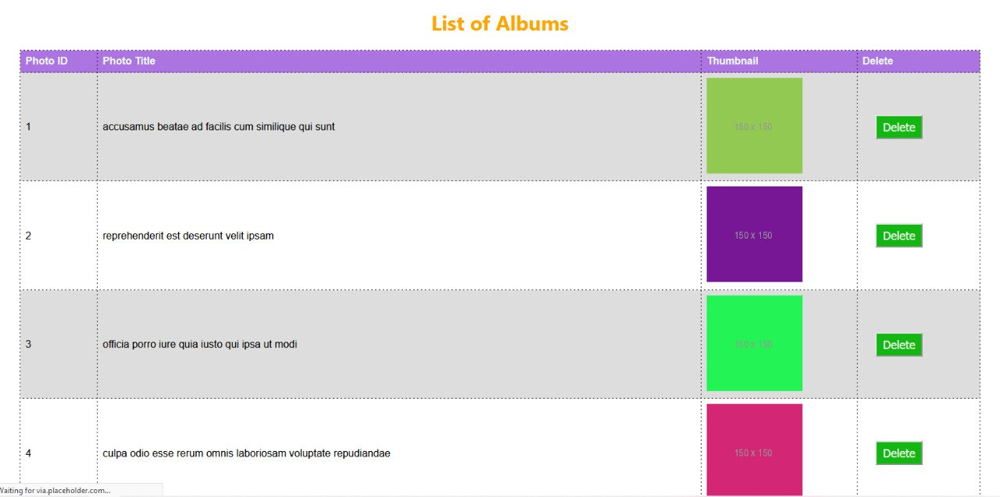
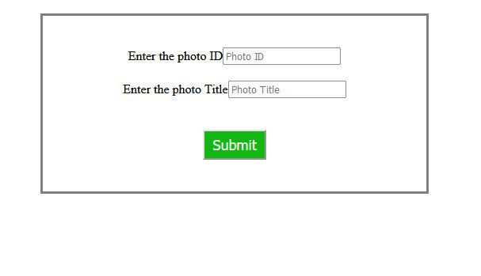
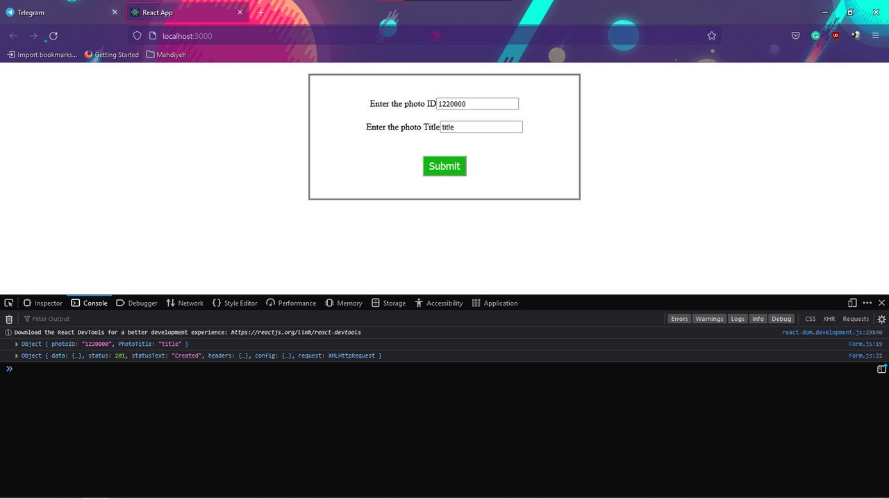

# Lab 5
### Part 1
##### REACT application that uses http requests to display data and delete data
An application that displays a list of photos in a table. The first column includes the ID of the photo, the second column includes the title of the photo, the third column includes the Thumbnail of the photo as an image and the last column includes a “delete” buttons (one for each row). <br>
For displaying the list of photos, axios get method is used to get the data from https://jsonplaceholder.typicode.com/photos . the call includes the “componentDidMount” function
Then for the delete row functionality, a new method handler is used for the button click, named “deleteRow” and it will be called on button click. Inside the method “deleteRow”, the axios method “delete” is used and sends the id of the row that the user wants to delete.
```
axios.delete(`https://jsonplaceholder.typicode.com/photos/${id}`){}
```
In the data in jsonplaceholder, you have the url of the images “thumbnailUrl”, use that to display the images in the third column as the following screenshot.
A separate css file is used to do the table css. 



### Part 2
##### A Simple Sign up form with React JS code
aanother component that makes it possible to add a new photo to the list of photos. The user only needs to enter the id and the title of the photo.



